# ПРАКТИКА 1
Веб-приложение(сайт) состоит из пользовательской и серверной части. Серверная часть работает на удаленном компьютере(сервере) и ее задачей является прием, обработка, хранение и передач данных пользователю или другим серверам. Пользовательская часть выполняется на устройстве пользователя с использованием имеющихся там ресурсов.

В основе веб-приложений лежит архитектура “клиент-сервер”, упрощенная схема взаимодействия клиента и сервера выглядит следующим образом:

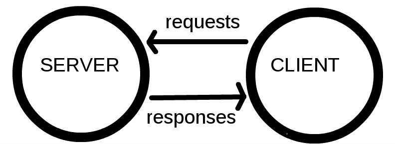

Приложение клиент, роль которого в нашем случае выполняет браузер, формирует запрос по установленному протоколу HTTP и отправляет его по IP-адресу на сервер. Сервер, единоразово или по частям, отправляет данные также в соответствии с протоколом HTTP. Подробнее про HTTP-запросы можно прочитать [здесь](https://developer.mozilla.org/ru/docs/Learn/Server-side/First_steps/Client-Server_overview#Web-%D1%81%D0%B5%D1%80%D0%B2%D0%B5%D1%80%D1%8B_%D0%B8_HTTP_(%D0%B4%D0%BB%D1%8F_%D0%BD%D0%B0%D1%87%D0%B8%D0%BD%D0%B0%D1%8E%D1%89%D0%B8%D1%85)), пара слов про IP-адреса [здесь](https://developer.mozilla.org/ru/docs/Learn/Getting_started_with_the_web/How_the_Web_works#DNS).

В веб-приложениях, которые мы будем создавать на данном курсе, серверная часть будет отвечать за раздачу статического контента (отправку файлов из папки с нашим проектом на пользовательскую часть) для этих целей подойдет любая реализация HTTP-сервера. Весь основной функционал наших приложений будет реализовываться на пользовательской стороне.

Основу пользовательской части составляют файлы трех типов: ``.html``, ``.css``, ``.js``.

В общем виде файлы(в случае одностраничного приложения - один файл) типа .html определяют элементы веб-страницы и некоторые инструкции для браузера по его обработке, файлы типа ``.css`` определяют форму отображения html-элементов, файлы типа ``.js`` содержат сценарии, которые могут выполняться в ходе взаимодействия пользователя с веб-страницей, в том числе сценарий может изменять элементы html-документа(вернее DOM-дерева - того, во что браузер превратил наш html-документ после его обработки).

На этом занятии мы разберем основные технологии, используемые в разработки пользовательской части веб-приложений.

## Что нам понадобится?
- **Сервис для хранения IT-проектов**: мы будем использовать [GitHub](https://github.com/), нужно создать там аккаунт;
- **Система поддержки контроля версий**: мы будем использовать Git, установить его можно здесь. В ходе установки выбираем все по умолчанию. После установки нам нужно привязать git к нашему аккаунт на GitHub чтобы мы могли без проблем получать и отправлять изменения во все доступные нам репозитории. Для этого откроем Git Bash, это можно сделать из меню Пуск или из всплывающего меню при нажатии правой кнопкой мыши внутри любой директории на вашем ПК включая Рабочий стол. Введем команду ``ssh-keygen`` и пропустим все что он нам предлагает при помощи клавиши ``Enter``. Эта команда сгенерирует уникальный ключ. Теперь нам нужно вывести этот ключ. Это можно сделать при помощи команды ``cat ~/.ssh/id_rsa.pub`` она выведет наш ключ. Необходимо скопировать вывод этой команды, затем перейти на сайт GitHub, открыть настройки аккаунта во всплывающим меню профиля в верхнем левом углу, перейти в раздел ``SSH and GPG keys`` нажать кнопку ``New SSH key``, в поле Title можно ввести любое значение, в поле Key вставляем скопированный раннее из вывода ключ и жмем ``Add SSH key``. Все теперь вы можете убедиться что все работает перейдя в той же консоли где мы создавали ключ в папку где вы бы хотели хранить практические этот материал (например ``cd desktop/itmo/datavis`` если вы запускали Git Bash из меню Пуск), скопировать с этой страницы  url репозитория, нажав на зеленую кнопку ``Clone or Download`` и затем на кнопку копирования рядом с адресом, вернуться в Git Bash и ввести команду ``git clone url`` заменив url на только-что скопированный с GitHub;

- **Текстовый редактор**, для работы с файлами нашего проекта, если у вас нет полюбившегося вам редактора, проще всего установить [VS Code](https://code.visualstudio.com/), он будет использоваться в примерах;

- **Http-сервер**, можно использовать питоновский сервер, если у вас Linux или Mac OS, Python уже установлен в вашей системе, если же Windows, его можно скачать [здесь](https://www.python.org/). Запустить сервер можно из терминала, находясь в рабочей директории проекта, при открытии папки с проектом в VS Code терминал открывается автоматически:


Чтобы проверить версию Python можно ввести в терминале команду python -v , если версия начинается с 2, команда для запуска сервера выглядит следующим образом ``python -m SimpleHTTPServer``, если у вас установлен python 3 версии, сервер запускается так: ``python -m http.server``. После запуска сервера мы можем обращаться к нему по адресу [127.0.0.1:8000](127.0.0.1:8000) или [localhost:8000](localhost:8000);

- **Браузер**, помимо просмотра документов многие браузеры содержат инструмент для просмотра и редактирования html кода страницы и всего используемого на ней дополнительного контента. В браузере [Chrome](https://www.google.com/intl/ru/chrome/) инструмент разработчика можно открыть через меню или двумя возможными сочетаниями клавиш ``Ctrl+Shift+I`` или ``F12``. Познакомится с инструментов разработчика в Chrome можно [здесь](https://developers.google.com/web/tools/chrome-devtools?utm_source=dcc&utm_medium=redirect&utm_campaign=2018Q2).

## HTML

Html-документ является корневым элементом веб-приложения. Отправляя запрос по IP-адресу браузер в ответ получает html-документ, и только его. Прочие, используемые в веб-приложении, файлы браузер получает отправляя дополнительные запросы по адресам, указанным в специальных элементах html-файла, все эти документы могут находится на других серверах и иметь другой IP-адрес. Внутри CSS или JS кода мы также моем отравлять http-запросы для получения разного рода данных.

Html-документ формируется из тегов, имеющих следующую форму: `<name attribute=”utf-8”>`. Перечень существующих в html тегов и их предназначение можно найти [здесь](https://developer.mozilla.org/en-US/docs/Web/HTML/Element). Среди атрибутов существуют глобальные атрибуты, которые могут быть присвоены любому из тегов, их перечень можно найти [здесь](https://www.w3schools.com/tags/ref_standardattributes.asp), а также атрибуты, которые предназначены для одного или нескольких тегов(перечень [здесь](https://www.w3schools.com/tags/ref_attributes.asp)).

Все теги рекомендуется явно закрывать при помощи закрывающего тега: `</имя-тега>` за исключением тегов `<meta>` и `<br>`. Внутри тега может содержаться текстовый контент и другие теги.

Шаблон html-документа с которым мы будем работать выглядит следующим образом:
```html
<!DOCTYPE>
<html>
    <head>
        <title>DataViz19</title>
        <meta charset=”utf-8”>
    </head>
    <body>
        Практика 1
    </body>
</html>
```
`<!DOCTYPE>` - говорит браузеру что мы используем версию HTML5, чтобы он заранее знал как его обрабатывать.
Внутри тега `<html>`  будут находится все элементы нашей страницы.

Тег `<head>` содержит информацию о документе, которая не отображается на самой странице; тег содержит заголовок, используемый браузером в качестве имени вкладки:

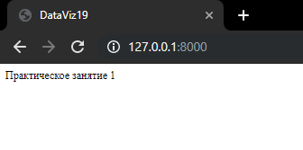

Мета-тег с атрибутом, указывающим на кодировку содержимого страницы, может очень пригодится если контент например содержит символы кириллицы. Если уберем этот тег с использованием комментария: `<!-- <meta charset=”utf-8”> →`
Содержание наше страницы приобретет не очень желаемый вид:

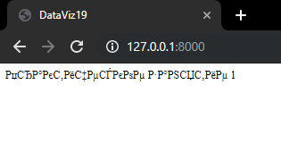

Внутри тега `<head>` могут могут также использоваться теги: `<link>` - для подгрузки стороннего контента(чаще всего css); `<script>` - для для подгрузки или содержания js скриптов; `<noscript>` - содержащий контент, отображаемый в случае если браузер не поддерживает js: `<style>` - содержащий заданные в html-документе таблицы стилей css; `<base>` - содержащий основной IP-адрес для всех относительных путей в документе (пример [здесь](https://www.w3schools.com/tags/tag_base.asp)).
И наконец тег `<body>` содержит в себе все элементы, отображаемые на нашей странице (конечно если мы не зададим им обратное).

### SVG

SVG (Scalable Vector Graphics) - язык разметки масштабируемой векторной графики, являющийся частью языка HTML. Этот язык позволяет нам при помощи специальных тегов создавать графические элементы на нашей странице.
Для начала работы с SVG необходимо создать svg-элемент и задать ему высоту и ширину в пикселях:

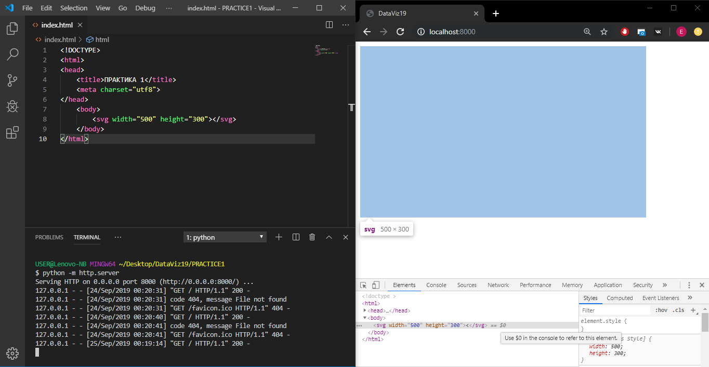

Из-за отсутствия других элементов на странице элемент не виден но если навести на него в инструменте разработчика мы увидим что он существует и имеет те размеры, которые мы ему задали.

Именно на этом холсте мы и будем рисовать необходимые нам фигуры, т.е. все графические элементы будет находиться внутри тега `<svg>`.

Давайте создадим окружность в центре холста и зададим ей радиус и цвет:

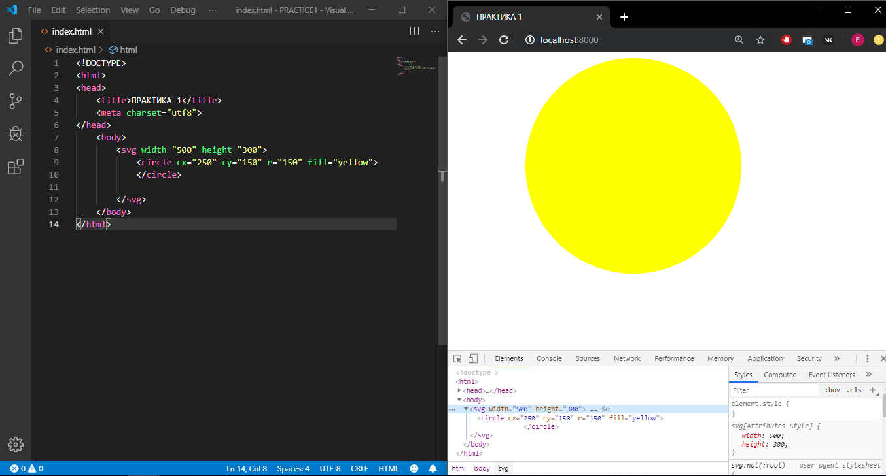

Теперь создадим эллипс из зададим ему радиус по осям x и y. Стоит помнить, что элементы в SVG обрисовываются в том порядке, в котором они расположены внутри svg-элемента:

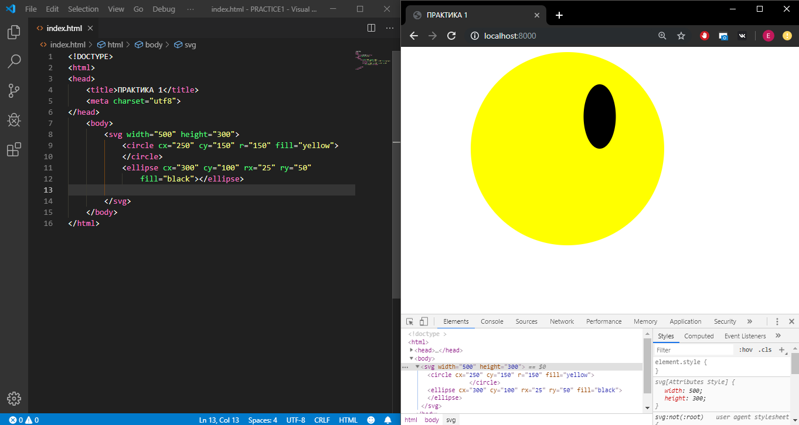

Теперь создадим прямоугольник. Начало координат в svg расположено в верхнем левом углу svg элемента поэтому прямоугольник растягивается вправо и вниз по мере увеличения ширины и высоты соответственно:

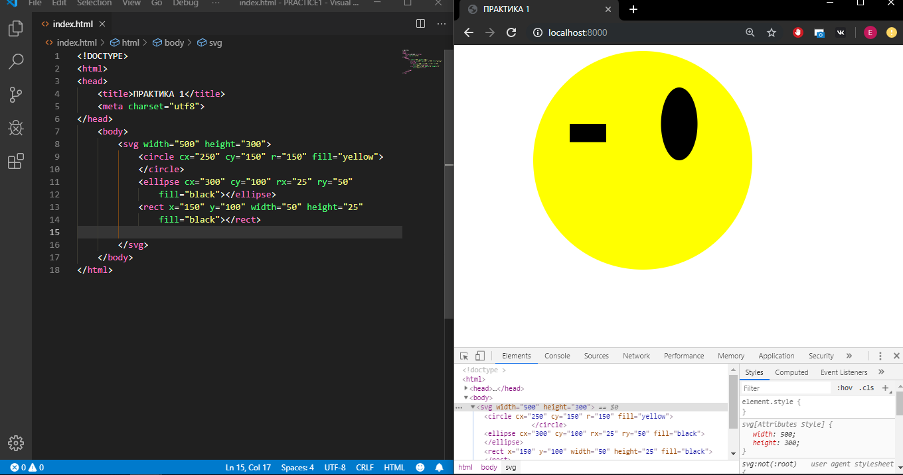

Помимо фигур существует такой элемент как “путь” (path). При помощи этого элемента можно создать любой другой элемент. Подробно познакомится с возможностями path можно [здесь](https://developer.mozilla.org/ru/docs/Web/SVG/Tutorial/Paths).

Создадим path от начальной точки квадрата до центра эллипса со смещением по оси-y при помощи квадратичной прямой. Принцип построения квадратичной прямой выглядит примерно так:

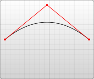

Расположим контрольную точку ровно посередине отрезка, заданного начальной и конечной точкой и в самом низу холста, path по умолчанию замыкается проводя прямую из конечной точки в начальную и по умолчанию заливается черным цветом:

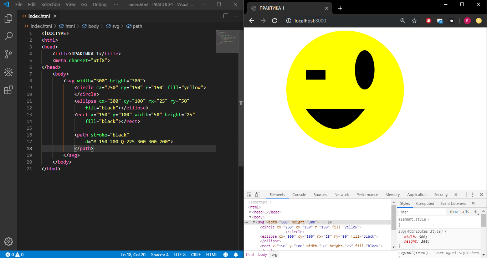

На текущий момент создали холст и добавили на него ряд элементов, давайте теперь добавим некоторой интерактивности.

## CSS

CSS (Cascading Style Sheets, каскадные таблицы стилей) - язык задания параметров отображения html элементов. 
CSS состоит из селекторов и свойств. 
Таблица стилей состоит из пар селекторов и блоков правил:

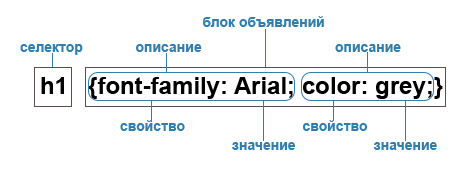

Селектор определяет к какому элементу или элементам применены заданные в следующем за ним блоке правила. Подробно про виды селекторов и многое другое можно почитать [здесь](https://html5book.ru/osnovy-css/).

Воспользуемся некоторыми возможностями css для задания интерактивности нашим элементам. Для начала добавим еще один эллипс на холст и положим его над прямоугольником. Создадим внутреннюю таблицу стилей при помощи тега `<style>` расположив его внутри тега `<head>`. Внутри таблицы стилей создадим первое правило, в качестве селектора будет выступать селектор элемента rect, в блоке обратимся к свойству `display` и установим для него значение none, данное правило говорит о том что мы хотим исключить этот элемент из списка отображаемых на странице. Создадим еще два селектора при помощи селектора атрибута для элемента `ellipse` с атрибутов `cx=”175”` и добавим для каждого из них псевдокласс состояния `:active`. Такой селектор указывает на наш эллипс с заданным атрибутом, находящийся в активном состоянии (т.е. активированный действиями пользователя). Зачем нам нужно два таких селектора? Первый действительно будет указывать на этот элемент в активном состоянии (ну или второй, приоритетность в этом случае не действует), а ко второму мы добавим + `rect`, таким образом он будет указывать на прямоугольник, идущий прямо за нашим эллипсом(для этого мы и располагали эллипс над прямоугольником). Теперь до пишем в блоке правил первого селектора `bisplay`: none, а второго `bisplay: block`. В результате получается следующая картина:

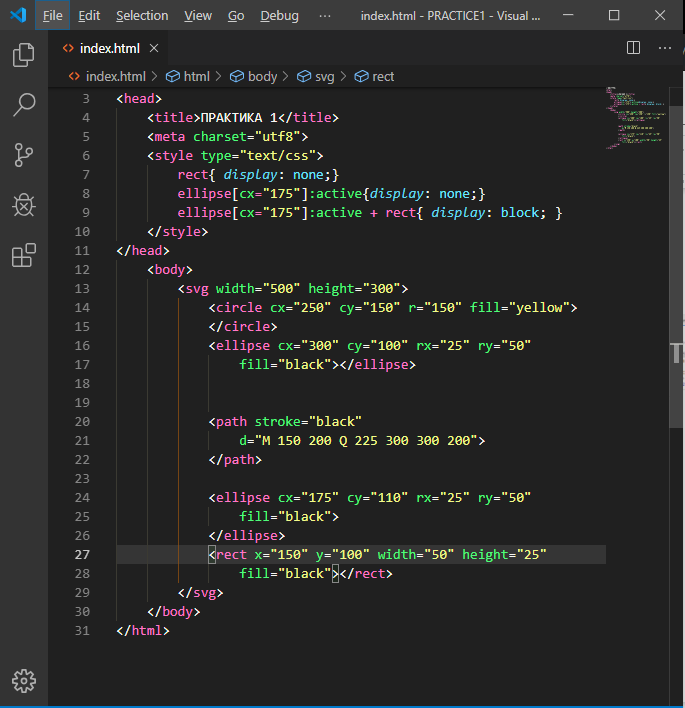

Что здесь происходит? Изначально эллипс, согласно дефолтным параметрам, отображается на странице, а прямоугольник не, поскольку мы задали это в первом элементе таблицы. При активации эллипса например щелчком мыши ему присваивается псевдокласс `:active` таким образом в действие вступают второй и третий селекторы. Эллипс получает `display: none` и пропадает с экрана, а свойство прямоугольника переписывается на `display: block` ввиду того что сестринский селектор родства `+` обладает большим приоритетом чем селектор элемента, заданный выше. Поскольку псевдокласс `:active` предназначен для быстрого подсвечивания ссылок при переходе по ним он автоматически спадает с элемента через весьма короткий период времени в результате чего слетают и два наших нижних селектора и элементы возвращаются к исходному состоянию. Результат вы можете видеть, обновив страницу и щелкнув по эллипсу:

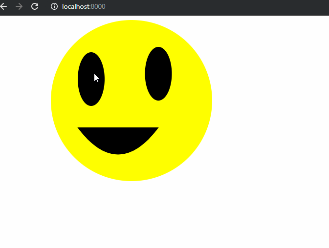

Помимо `active` есть еще ряд псевдоклассов состояния, которые мы можем использовать для задания некоторой интерактивности на нашей странице, всех их можно найти по последней ссылке. Но на этом мы пока остановимся. Единственное что мы можем несколько улучшить наш код сохранив тот же функционал. На текущий момент мы используем селектор атрибута для идентификации эллипса, оно конечно здорово и главное работает, но что если мы захотим добавить еще интерактивности в результате чего позиция нашего эллипса будет меняться или просто вручную изменим ее, тогда нам придется менять и наш селектор иначе он будет не действителен, а мы не хотим делать в нескольких местах одно и то же. Для того что бы избежать такой ситуации можно присвоить эллипсу класс. Имя класса не несет какого-либо смысла для браузера и может быть любым, выберем первое что придет в голову, например `left-eye`. Присвоим его элементу при помощи атрибута `class` и теперь вместо комбинации селектора элемента и атрибута мы можем использовать селектор класс в нашей таблице стилей, обозначаемый следующим образом: `.left-eye`.  В результате наш код будет выглядеть как изображено ниже, и мы можем убедится обновив страницу что все работает как прежде.


Поскольку мы наша таблица стилей в большом проекте может разрастаться до неприличных размеров мы можем принести ее содержимое во внешнюю таблицу создав файл с именем например `style.css` в папке css и подключив его к нашему html документу при помощи тега `<link>` с указанием назначения содержимого и относительного пути от корня нашего проекта:


Как мы успели убедится мы можем добавлять интерактивность на страницу при помощи псевдоклассов состояния, автоматически присваиваемых браузером элементам html при определенных действиях пользователя, но псевдокласс дает нам только два возможных состояния объекта, а нам может понадобиться, например отображать определенное количество точек на карте в зависимости от выбора пользователя. Конечно, мы можем это реализовать, создав элемент `<input>` и задав необходимое количество селекторов атрибутов для всех возможных значений атрибута `value` которому присваивается значение, введенное пользователем, однако это не очень удобно и мы не всегда знаем те значения с которыми наше приложение будет работать. А что, если мы хотим получать данные отдельно, обрабатывать их и отображать на странице изменяя атрибуты соответствующих элементов? Или менять состояние элемента через указанный период времени? Или, например реагировать на изменение позиции мыши? Тогда нам только одна дорога…

## JavaScript


**JavaScript** — язык сценариев, или скриптов. Скрипт представляет собой программный код — набор инструкций, который не требует предварительной обработки (например, компиляции) перед запуском. Код JavaScript интерпретируется движком браузера во время загрузки веб-страницы. Интерпретатор браузера выполняет построчный анализ, обработку и выполнение исходной программы или запроса.
Так же как таблицы стилей сценарии JavaScript бывают встроенные, хранящиеся внутри тега `<script>` и внешние, хранящиеся в отдельном файле с расширением `.js` и подключаемы при помощи атрибута `src` того же тега. Также сценарии могут быть занесены в значение атрибутов элементов, отвечающих за обработку событий (например атрибут `onClick`).

Все используемые на странице скрипты выполняются как единая программа на одном участке оперативной памяти, например мы можем получить доступ к данным, записанным в оперативную память сценарием из внешнего скрипта при помощи скрипта записанного в значении атрибута.

Вот перечень сущностей JavaScript с которыми нам нужно познакомиться что бы нашему воображению было с чем работать:
- [Переменные](https://learn.javascript.ru/variables) 
- [Типы данных](https://learn.javascript.ru/types)
- [Преобразование типов](https://learn.javascript.ru/type-conversions)
- [Операторы](https://learn.javascript.ru/operators)
- [Логические операторы](https://learn.javascript.ru/ifelse)
- [Циклы](https://learn.javascript.ru/while-for)
- [Функции](https://learn.javascript.ru/function-basics)
- [Объекты](https://learn.javascript.ru/object-methods) 

Этой информации нам будет достаточно чтобы стартовать. На том же портале содержится много полезной информации по JavaScript, но нам сейчас нужно посмотреть, как же мы будем это все применять в деле. Давайте вернемся к нашему примеру. Было обещано что мы сможем получать и изменять значения атрибутов наших html элементов. Давайте заставим наши элементы вращаться по часовой стрелке, примерно вот так:


Для этого сначала немного изменим наш документ, а именно сгруппируем необходимые элементы. Создадим тег `<g>` внутри svg-элемента и помести внутрь его все остальные svg-элементы.
Под svg-элементом создадим тег `<script>` внутри которого мы будем писать наш сценарий. Создадим при помощи ключевого слова `const` константу с именем g которой присвоим соответствующий элемент. Это можно сделать при помощи метода селекции встроенного объекта `document`, представляющего структуру нашего html-документа. В качестве метода селекции рекомендуется использовать метод `querySelector()` , который в качестве параметра принимает строку, содержащую уже знакомый нам css-селектор. В качестве селекторы используем селектор элемента указав его имя - `g`. Теперь у нас есть переменная, в которую записан групповой элемент, содержащий все остальные элементы холста. Введем переменную, в которой мы будем сохранять значение угла, на который повернута группа элементов в градусах. Поскольку ее значения в ходе выполнения сценария будет меняться объявим эту переменную при помощи ключевого слова `let`, затем укажем имя переменной, например angle, и присвоим начальное значение равное `0`. Элемент и текущий угол у нас есть, отлично. Как же этот элемент будет вращаться? Для поворота элемента мы будем использовать атрибут `transform`, меняющий положение элемента относительно его изначального положения, и укажем в качестве значения встроенную в html функцию `rotate()` которая в качестве аргументов принимает угол поворота в градусах, x и y точки, вокруг которой осуществляется поворот. По дефолту, если указан только угол поворота, поворот осуществляется вокруг начала координат. В нашем случае центром поворота будут координаты центра самой большой окружности, указанные в ее атрибутах.

Чтобы заставить элементы группы вращаться постоянно мы используем встроенную функцию `setInterval()` которая в качестве аргументов принимает другую функцию, которую нужно выполнять по проходу определенного периода времени и длительность этого периода в миллисекунда.
Итак, сейчас наш скрипт содержит объявления двух переменных: группы и угла. Ниже мы вызываем функцию `setInterval()`  в которую  первым аргументом мы передаем безымянную функцию без аргументов в теле которой мы обращаемся к объекту хранящемуся переменной g и вызываем метод `setAttrbute()` который наследуется всеми объектами, представляющими элементы html страницы выбранные при помощи селекторов объекта document . данный метод принимает два аргумента: имя атрибута и его значение в виде строки. Вторым аргументом функции `setInterval()`  подберем значение интервала при котором вращение элементов будет заметно(например 100). В итоге код преобретает следующий вид:

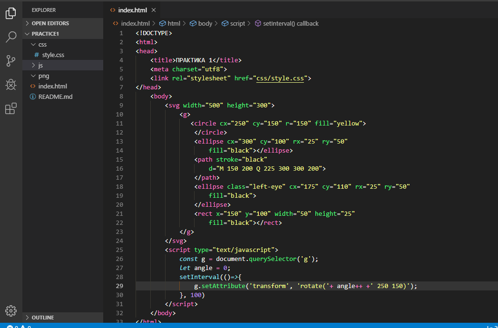

Как видно на скрине со вторым аргументом функции `setAttrbute()` не все так просто. Мы не хотим передавать туда одни и те же значения, мы хотим менять значения угла поэтому мы генерируем второй аргумент при помощи выражения. Высший приоритет в нем имеет оператор инкремента `++` который мы уже видели в примере с циклом, он прибавляет `1` к текущему значению переменной к которой он применяется и сохраняет новое значение в эту же переменную, после чего выполняется сложение полученного значения со строками, указанными по краям выражения на выходе получается строка, содержащая значение угла на месте первого атрибута.
Таким образом наш код каждые 100 миллисекунд присваивает новое значение атрибута `transform` элемента `g` содержащие значение угла поворота на `1` градус больше, чем при предыдущем измерении значения, при этом координаты центра остаются неизменными. За динамическим изменением атрибута можно понаблюдать из инструмента разработчика. 

Теперь давайте вынесем на этот раз наш сценарий в отдельный файл папки js с расширением `.js`. Для этого с вырежем содержимое элемента `<script>` в этот файл и добавим ему атрибут `src` с указанием относительного пути к файлу.

Отлично, вот только мы снова совершили ту же ошибку, значения центра окружности вновь указаны в двух местах нашего проекта.  Чтобы это исправить введем еще одну константу, представляющую собой окружность. Сделаем это при помощи все того же метода `document.querySelector()` . После чего мы можем создать еще две константы, которые будут соответствовать значениям атрибутов `cx` и `cy` этого элемента. Сделать это можно при помощи метода `getAttribute()` объекта, представляющего соответствующий элемент, данный метод принимает единственный аргумент - имя атрибута.
После чего нам останется лишь заменить значения в строке на имена только что созданных констант. Поскольку наше выражение становится весьма длинным, давайте заменим его на шаблон строки. Шаблон содержится внутри специальных скобок и может содержать в себе переносы на новую строку, но нам сейчас они не нужны, нам нужны заполнители, заполнители обозначаются так `${выражение}`, у нас таких будет три, по числу аргументов функции `rotate()`. Первый заполнитель в качестве выражения будет содержать инкременту переменной `angle`, а следующие два имена переменных `x` и `у` соответственно. В итоге наш код будет выглядить так:

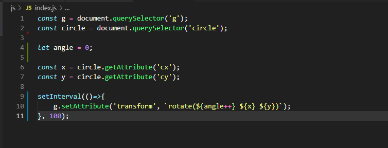

## Итоги

Сегодня мы познакомились с основными инструментами, необходимыми нам для визуализации данных средствами веб-браузера. Как мы могли заметить HTML, CSS и JavaScript предоставляют достаточный функционал для создания разного рода интерактивной векторной графики, с которой может взаимодействовать любой пользователь имеющий под рукой веб-браузер и доступ в интернет.

На следующем занятии мы начнем знакомство с библиотекой [D3](https://d3js.org/), созданной для упрощения создания векторной графики на основе данных и начнем с того, что с ее помощью научимся получать данные при помощи скрипта.
