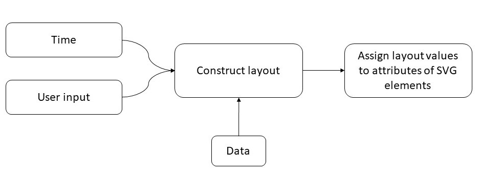

# ПРАКТИКА 2

## Прощесс визуализации данных

Ниже схематично изображен процесс визуализации данных с использованием SVG.


## D3

[D3js](https://d3js.org/) (Data-Driven Documents) - библиотек на языке JavaScript, созданная для упрощения манипуляции html-элементами при помощи данных. 
D3 включает в себя инструменты, поддерживающие каждый из этапов визуализации данных при помощи SVG. В данной практике мы рассмотрим инструменты для взаимодействия с SVG элементами.

### Как подключить D3 к своему проекту ?

Мы можем подключить D3 при помощи сетевой ссылки
```html
<script src="https://d3js.org/d3.v5.min.js"></script>
```
Или [скачать](https://github.com/d3/d3/releases) d3 архивом, распоковать в папку с зависимостями своего проекта и импортировать по относительному пути внутри своего проекта.
```html
<script src="/src/d3/d3.min.js"></script>
```


### Импорт данных

[D3-fetch](https://github.com/d3/d3-fetch) позволяет получать различные данные при помощи запросов и выполняет предварительное преобразование полученных данных.

Все методы `d3-fetch` возвращают [`Promise`](https://developer.mozilla.org/en-US/docs/Web/JavaScript/Reference/Global_Objects/Promise). `Promise` также как [`async function`](https://developer.mozilla.org/en-US/docs/Web/JavaScript/Reference/Statements/async_function) возвращает объект представляющий успех или провал выполнения асинхронной операции и соответствующее значание. Как только объект `Promise` перешел в состояние `resolve` он автоматически вызывает функцию `then` и `catch` если он перешел в состояние `reject`. 
```javascript
d3.csv("/data/employees.csv").then(function(data) {
    for (var i = 0; i < data.length; i++) {
        console.log(data); // [{name: "foo"},{name: "bar"},...]
    }
});
```

Вы также можете использовать `Promise` внутри асинхронных функций и при помощи ключевого слова `await` дождаться выполнентя `Promise` и получить его значение:
```javascript
(async () => {
  let data = await d3.csv("/data/employees.csv");
  console.log(data); // [{name: "foo"},{name: "bar"},...]
})();
```

### Селекция

D3 поддерживает декларативный подход в работе с селекциями элементов `DOM` дерева. Например следующий код окрасит все параграфы в голубой:
```javascript
d3.selectAll("p").style("color", "blue");
```
При выборки одного элемента синтаксис будет тоже:
```javascript
d3.select("body").style("background-color", "black");
```

Все атрибуты могут также быть определены как функция от данных. Чтобы передать данные внутрь функции нужно сперва привязать их к выборке при помощи функции `data`.
```javascript
d3.select("svg").selectAll("circle")
        .data(data).attr("r", function(d){ return d.age });
```

#### Enter & Exit выборки

Используя `enter` и `exit` выборки можно создавать новые элементы и удалять лишние в зависимости от размере привязанного массива данных.

Когда массив данных привязывается к определенной выборки каждому элементу в массиве данных соотносится определенный `html` элемент в выборки. Если существующих элементов меньше чем данных, недостающие элементы сформируют `enter` селекцию, к которой можно применить метод `append` для добавления в `DOM`:
```javascript
// если в svg нет еще не одного circle
d3.select("svg").selectAll("circle")
        .data(data).enter()
        .append().attr("r", function(d){ return d.age });
```

Распространенной практикой является разбиения селекции на три части и прописывание логики для каждой из них:

```javascript
// Update
var p = d3.select("svg")
  .selectAll("circle")
  .data(employees)
    .attr('cx', function(d) { return d.age; });
    .attr('cy', function(d) { return d.experience; });
    .attr('r', function(d) { return d.salary; });

// Create 
p.enter().append("circle")
    .attr('cx', function(d) { return d.age; });
    .attr('cy', function(d) { return d.experience; });
    .attr('r', function(d) { return d.salary; });


// Remove
p.exit().remove();
```
### Шкалы

[Шкалы](https://github.com/d3/d3-scale) используются для соотношения значений из набора данных с визуальными каналами.

В d3 есть много различных типов шкал. Наиболее распространенные:

- [Линейная](https://github.com/d3/d3-scale#linear-scales)
- [Дискретная](https://github.com/d3/d3-scale#ordinal-scales)
- [Степенная](https://github.com/d3/d3-scale#power-scales)
- [Логорифмическая](https://github.com/d3/d3-scale#log-scales)
- [Band](https://github.com/d3/d3-scale#band-scales)
- [Time](https://github.com/d3/d3-scale#scaleTime)

Вот пример использования лишейной шкалы:
```javascript
var x = d3.scaleLinear() // или d3.scaleLinear([10, 130], [0, 960])
    .domain([d3.min(ages), d3.max(ages)]) // тут ages это столбец из данных
    .range([0, 960]); // начальная и конечная точка в svg

x(20); // 80
x(50); // 320

x.invert(80); // 20
x.invert(320); // 50
```
Массивы в `domain` и `range` не ограничены двумя элементами но должны быть одинаковой длины.

Например, несколько элементов могут быть использованы для создания цветового градиента: 
```javascript
var color = d3.scaleLinear()
    .domain([-1, 0, 1])
    .range(["red", "white", "green"]);

color(-0.5); // "rgb(255, 128, 128)"
color(+0.5); // "rgb(128, 192, 128)"
```

[`Степенная`](https://github.com/d3/d3-scale#power-scales) и [`логорифмическая`](https://github.com/d3/d3-scale#log-scales) шкалы используются для нелинейной интерполяции между значениями.

### Axes

[d3-axis](https://github.com/d3/d3-axis) создает шкалы в человекочитаемом формате.
Рендериг шкал всегда происходит в системе координат `svg`-контейнера. Для перемещения шкалы на необходимое место можно использовать атрибут `transform`.
```javascript
let x = d3.scaleLinear()
      .domain([0,1])
      .range([0, 100]);

d3.select("body").append("svg")
    .attr("width", width)
    .attr("height", height)
  .append("g")
    .attr("transform", `translate(0,${height - padding})`)
    .call(d3.axisBottom(x));
```

Сгенерированный `html` будет иметь примерно следующий вид:
```html
<g fill="none" font-size="10" font-family="sans-serif" text-anchor="middle" transform="translate(0,100)">
  <path class="domain" stroke="currentColor" d="M0.5,6V0.5H880.5V6"></path>
  <g class="tick" opacity="1" transform="translate(0.5,0)">
    <line stroke="currentColor" y2="6"></line>
    <text fill="currentColor" y="9" dy="0.71em">0.0</text>
  </g>
  <g class="tick" opacity="1" transform="translate(176.5,0)">
    <line stroke="currentColor" y2="6"></line>
    <text fill="currentColor" y="9" dy="0.71em">0.2</text>
  </g>
  <g class="tick" opacity="1" transform="translate(352.5,0)">
    <line stroke="currentColor" y2="6"></line>
    <text fill="currentColor" y="9" dy="0.71em">0.4</text>
  </g>
  <g class="tick" opacity="1" transform="translate(528.5,0)">
    <line stroke="currentColor" y2="6"></line>
    <text fill="currentColor" y="9" dy="0.71em">0.6</text>
  </g>
  <g class="tick" opacity="1" transform="translate(704.5,0)">
    <line stroke="currentColor" y2="6"></line>
    <text fill="currentColor" y="9" dy="0.71em">0.8</text>
  </g>
  <g class="tick" opacity="1" transform="translate(880.5,0)">
    <line stroke="currentColor" y2="6"></line>
    <text fill="currentColor" y="9" dy="0.71em">1.0</text>
  </g>
</g>
```
